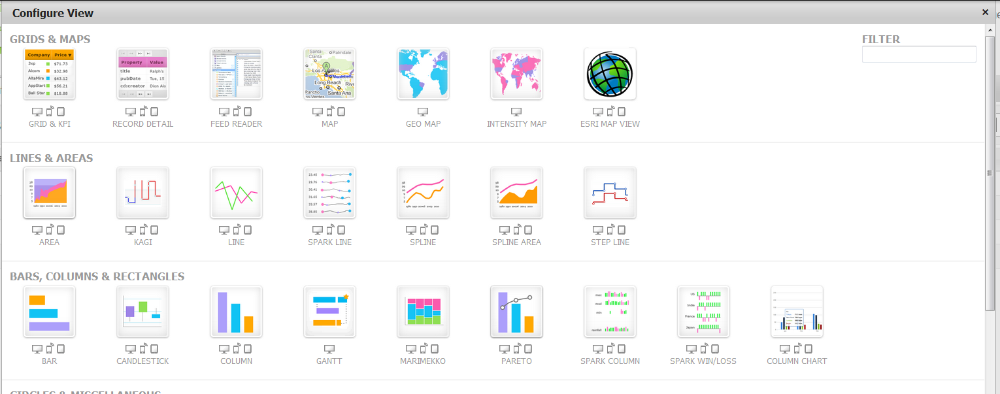
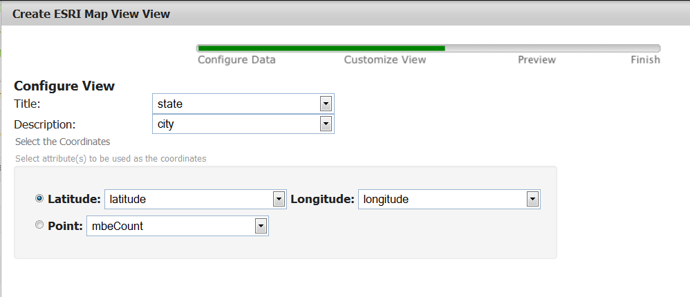
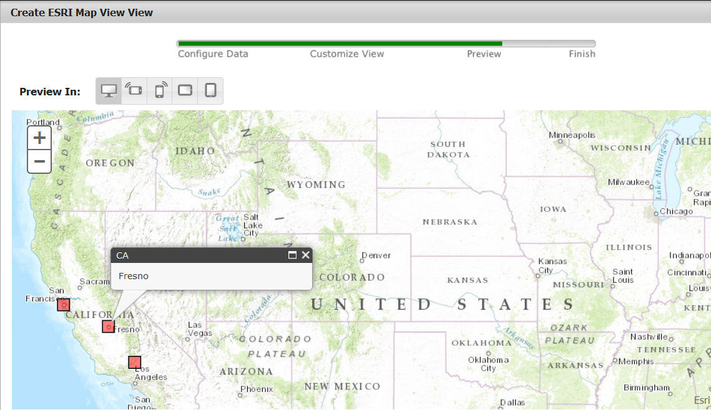
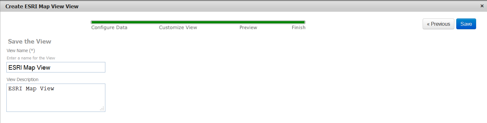

presto-extensions/visualizations/esri
=================

This visualization uses the ESRI (www.ESRI.com) mapping API to render basic point on a map and is intended to be deployed on the Presto Server as a Pluggable View.
http://mdc.jackbe.com/prestodocs/v3.6/views-dev/createCustomView.html

Installation
=================

1. This library was designed to be quickly deployed using Ant.
2. Open the build.properties file and ensure the Presto username, password, and host are correct.  By default these are set to the default installation settings.
3. Open the build.xml file and update the presto.lib.import variable to point to a copy the prestocli.jar library on your local machine.
4. Run the build file and ensure the library was deployed correctly to Presto.

Usage
=================

1. In order to use this view the underlying service must have geo-information in the form of a Point(Lat, Lon) or Latitude and Longitude.  Open the service in the Presto Hub.
2. 
3. 
4. 
5. 

Tested On
=================
Presto 3.6